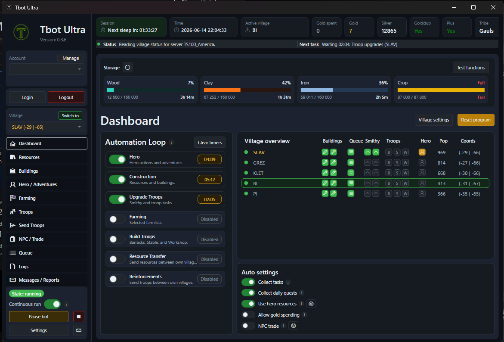

# Tbot Ultra

`Preview` of the program


<p align="center">
  
</p>

---

Join our `Discord!`

Here you can ask questions, report bugs and come with suggestions for new features.

[](https://discord.gg/7bgzKy9sHK)


---

## TBot Ultra - Advanced Travian Bot
Advanced open-source `Travian Bot` for Travian Legends with automation, farming, building management, resource optimization and `multi-village support`.

Also works for SS-Travian private server but the main goal forward is the official Travian servers.

## What can this program do?

Tbot Ultra is an automation tool for Travian. It helps players automate repetitive tasks such as village management, resource handling, farming, troops and construction.

Compatible with:

- `Official Travian` — Travian Legends 4.6+ — Official servers

- `SS-Travi` — T4.4 — Private server

`NOTE:` It is important that the language is set to `English` in the travian browser settings page.

`Way forward:` The goal of the project forward is to focus on the official servers. SS-Travi is not in the same developement anymore.

## Features:

- Automatic building
- Hero adventures
- Revive hero
- Spend hero attribute points
- Use hero inventory resources to top up when short (Official only). Per-consumer toggles on the Hero tab pick which features may pull from the hero: **Construction** (buildings & resource fields), **Smithy** (troop upgrades), and **Brewery** (celebrations). The master hero-resource toggle in Auto settings still applies on top.
- Collect daily quests
- Collect tasks
- Read messages and reports
- Upgrade troops in smithy (choose which troops and their target level **per village** via the Troops tab's "Upgrade options"; "Sync to all villages" copies the selected village's choice to every village). The Automation Loop's *Upgrade Troops* group runs them.
- Send resources between own villages
- Send reinforcements between own villages
- Farming
- Create multiple Official farmlists with selected village and default troops
- Configure the Official Add Farms internal step delay in Settings (default 0.1-0.3 seconds)
- Scan the authenticated Travian map for oases by resource type and save them as reusable farm-source lists
- Send catapult waves
- Session pacing
- Auto sleep
- Captcha solver (SS-Travi servers)
- Read game status
- Read village data
- Clean dark mode UI
- Multi-village support
- Calculate building time and resource cost for buildings + resourcefields
- Oasis scan for whole map (and add to farmlists)

## Future functions:

- +15% resource production for 8h automatic watch video
- reduce adventure duration button / video watch
- increase adventure to hard button / video watch
- construct 25% faster button / video watch

## Known bugs:

Please visit the [issues page](https://github.com/fetmamm/Tbot_ultra_new/issues) for known bugs or the [Discord channel](https://discord.gg/7bgzKy9sHK).

---

## Download

Goto the latest [Releases](../../releases) page and download:

- **Portable** (`tbot-ultra-win-x64-...-portable.zip`)

Extract the zip file

Run `Tbot Ultra.exe` inside the extracted folder.

Windows may show a SmartScreen or certificate warning because the application is not digitally signed. This is normal and does not indicate a virus or security issue.

If prompted, click More info → Run anyway.

Set up your account and server inside the app (**Account → Manage**)

**Multiple accounts at once:** with the portable build, extract a separate copy of the
folder per account (e.g. `Tbot-account1\`, `Tbot-account2\`) and run them at the same
time — each copy keeps its own config, account, browser session and logs. Don't run two
instances from the same folder.

---

## Multi-village support

The bot manages every village on the account from one **Dashboard → Village overview** list.

- **Per-village on/off:** open **Village settings** and use the *Auto* toggle to choose which
  villages the bot works in. Disabled villages are skipped entirely. The capital is on by default;
  newly discovered villages start off. Choices are saved per account and survive restarts/renames.
- **Village overview columns:** a green/grey dot left of the name shows if a village is enabled, plus
  per-village indicators for **Buildings** (active construction slots — 2, or 3 for Romans), **Queue**
  (green when something is queued), **Smithy**, **Troops** (Barracks/Stable/Workshop) and **Hero**
  (green = hero home here, yellow = away, red = dead). For Buildings/Smithy/Troops the icons are **green**
  when something is actively running, **amber** when a task is deferred/waiting (e.g. out of resources or
  the build queue is full) and grey when idle — so a village waiting on resources isn't mistaken for idle.
  A green border marks the village the browser is currently working in.
- **One queue per account:** each task carries its target village, and the bot rotates between enabled
  villages (draining one, then moving on so a village waiting on resources never blocks the others).
- **Per-village automation groups & NPC trade:** the Automation Loop groups (Construction, Build Troops,
  …) can be enabled per village. NPC trade has an account-wide master toggle in **Auto settings** plus a
  per-village choice in **Village settings** — it runs only when both are on.
- **Village settings popup:** *Auto* is the green on/off toggle; every other toggle (NPC and the group
  columns) is blue when on. Hover the **i** icon next to the title or any column header to read what it
  does. Changes are applied with **Save & close**; **Close** discards them.
- **Switch village** moves the browser to the village selected in the dropdown; selecting a village in
  the dropdown only changes the view/queue context (it does not navigate).
- **Clear timers** resets cached activity timers for the selected village and requests fresh status
  reads without removing items from the Queue page.
- Activity timers are stored as absolute UTC finish times, so active construction, troop, smithy,
  hero, brewery, and farm-list countdowns continue correctly after restart or machine sleep.
- Construction queue waits are reconciled with live village status, so a newly free normal or Plus
  building slot wakes the next queued construction instead of waiting on a stale timer.
- A construction already running for one queued item no longer blocks later items from using the
  second Travian Plus building slot.

---

## Solution layout

```
TbotUltra.sln
├── TbotUltra.Core          shared domain (no UI, no browser, no I/O)
├── TbotUltra.Worker        engine: browser automation + queue executor
├── TbotUltra.Worker.Tests  xUnit tests for the worker
├── TbotUltra.Desktop       WPF UI (the app the user runs)
└── TbotUltra.Desktop.Tests xUnit tests for desktop view models / services
```

Dependency direction: `Desktop → Worker → Core`. Core has no dependency on
the others.

---

## Top-level folders

| Folder | Purpose |
|---|---|
| `src/` | All C# projects (see "Source tree" below). |
| `config/` | Runtime configuration and persisted state (queue, accounts, caches). |
| `Captcha_solver/` | Standalone Python + tiny C# launcher for captcha solving. |
| `assets/` | App icons used by the WPF project and installer. |
| `installer/` | Inno Setup script (`TbotUltraSetup.iss`) for building the Windows installer. |
| `playwright/` | Local Playwright browser cache (downloaded on first run). |
| `ms-playwright/` | Same — Playwright's default cache location. |
| `.release-template/` | Files copied into release builds (`README_RELEASE.txt`, env template, default config). |
| `.github/workflows/` | CI: `build-exe-on-version.yml`, `discord-push.yml`. |
| `artifacts/` | Local verification artifacts (gitignored). |
| `logs/` | Runtime logs from the desktop app (gitignored). |
| `temp_build_out/` | Scratch space for ad-hoc local builds (gitignored). |

Top-level files worth knowing:

- `AGENTS.md` — coding rules for AI assistants working in this repo.
- `VERSION` — current version string, consumed by CI.
- `Start_Tbot.bat` / `Start_Tbot_UI.vbs` — launchers.
- `Smoke_Check.bat` — build + run worker tests.

---

## Source tree

### `src/TbotUltra.Core/` — shared domain

Pure C#, no WPF, no Playwright. Safe to reference from both Worker and tests.

```
Accounts/         AccountKeyNormalizer, AccountStoragePaths, constants
Configuration/    BotOptions + factory, .env parser, payload key mapping
Tasks/            TaskCatalog + all task payload records (Building, Hero,
                  Farming, Reinforcements, ResourceTransfer, TroopTraining, …)
Travian/          Game-data catalogs (TroopCatalog, TroopTrainingBuildingType)
```

### `src/TbotUltra.Worker/` — engine

Runs the browser, executes queue items, talks to Travian.

```
Program.cs                  worker host entrypoint
Worker.cs                   top-level background service loop
ProjectContext.cs           resolves project root + paths at runtime
ProjectRootLocator.cs

Configuration/              AccountOptions binding
Domain/                     QueueItem, QueueGroup, QueueStatus,
                            TravianModels, CatapultWaveLimits, exceptions
Infrastructure/             BrowserSession (Playwright wrapper)

Services/
  Accounts/                 EnvAccountProvider, AccountAnalysisStore,
                            NatarFarmCacheStore
  Automation/               TravianClient.* — partial classes per concern
                            (Buildings, Hero, Inbox, Resources, Catapults,
                             NpcTrade, ResourceTransfer, Reinforcements,
                             TroopTraining, BreweryCelebration, CapitalCache,
                             CaptchaAutoSolve, RetryPolicy, Selectors)
                            CatapultWavePlanner
  Catalogs/                 BuildingCatalogService, TaskCatalog
  Queue/                    JsonQueueStore, PriorityFifoQueueScheduler,
                            QueueExecutor, QueueGroupCatalog, interfaces
  BotTaskRunner.cs          dispatches a TaskDescriptor onto TravianClient
  CaptchaAutoSolver.cs      bridge to the Python solver
```

### `src/TbotUltra.Desktop/` — WPF UI

The main app. MainWindow is split into many partial files, one per feature
tab/area, so the codebase scales without one massive file.

```
App.xaml / App.xaml.cs            WPF entry
MainWindow.xaml                   root window
MainWindow.<Feature>.cs           partial classes, grouped by feature:
                                    AutomationLoop, Buildings, ContinuousLoop,
                                    Dashboard.*, Farming.*, Hero, Inbox,
                                    Logging.*, QueueExecution, QueueUi.*,
                                    Reinforcements, Resources.*,
                                    ResourceTransfer, SendTroops.Catapults,
                                    TroopTraining
<Name>Window.xaml(.cs)            dialogs (Accounts, AddQueueItem, Settings,
                                  ServerList, Support, FunctionTest, …)

Assets/                           app icon
Common/                           BaseViewModel, RelayCommand
Models/                           row/option types bound to the UI lists
Services/
  Logging/  LogClassifier
  Orchestration/  LoopController
  AccountDeletionService, BotConfigStore, DesktopBotService,
  EnvAccountStore, ManualFarmingPreferenceStore,
  ServerCatalogStore, ServerDiscoveryService
Themes/                           Badges/Buttons/Toggles/Tooltips resources
ViewModels/                       Hero, Inbox, Main, Resources, TroopTraining
Views/                            BuildingsPanel, HeroPanel, InboxPanel,
                                  TroopsPanel (user controls hosted by MainWindow)
```

### `src/TbotUltra.Worker.Tests/` & `src/TbotUltra.Desktop.Tests/`

xUnit. Each test file targets one class (e.g.
`QueueStoreAndSchedulerTests`, `BuildingCatalogServiceTests`,
`HeroViewModelTests`, `ServerDiscoveryServiceTests`).

---

## `config/` — runtime state

```
bot.json                   active bot options (UI writes here)
buildings_catalog.json     static building data
servers.user.json          user's saved server list
accounts/<account>/        per-account state:
                             queue.json          persisted task queue (one per account)
                             queue.json.lock     file lock to serialize queue writes
                             villages.json       per-village enable / NPC / group choices + hero home
                             village_cache.json  remembered buildings/fields/storage per village
account-analysis/          cached account snapshots
cache/                     capital-state, manual-farming prefs, natar-farms
```

`.env` lives at repo root and holds credentials / per-account secrets.

---

## `Captcha_solver/`

Optional component. C# launcher (`Program.cs`, `Program_test.csproj`) plus a
Python ML project under `math_ai/` (Keras model, training and inference
scripts, dataset folders). Started by the worker when an arithmetic captcha
needs solving.

---

## Conventions

- Code and UI are English (see `AGENTS.md`).
- `TravianClient` is intentionally split into many partial files — keep the
  same pattern when adding a new browser-driven feature.
- MainWindow likewise uses one partial per feature.
- Core has no references to Playwright or WPF — keep it that way.
- Don't commit anything under `artifacts/`, `logs/`, `temp_build_out/`,
  `bin/`, `obj/`, `playwright/`, `ms-playwright/`.

---

## Status

- Runtime + UI fully C# (`TbotUltra.Desktop` + `TbotUltra.Worker`).
- Queue persists per account in `config/accounts/<account>/queue.json`, managed from the Queue tab.
- Captcha solving handled by the Python module in `Captcha_solver/`.

---

## Disclaimer

This project is provided for educational purposes. Automating gameplay may
violate the terms of service of Travian and/or private servers, and can lead
to account bans. Use it at your own risk — the authors take no responsibility
for any consequences of using this software.

Credentials and per-account data are stored locally only (in `.env` and
`config/`, all gitignored) and are never committed to this repository.

---

## License

Released under the [MIT License](LICENSE).

---

## Keywords
Travian Bot, Travian Automation, Travian Legends, Travian Scripts, Travian Game Bot, Travian Farming Bot, Travian Automation Bot, Browser Game Automation, Browser Game Bot, Python Bot, C# Bot, Open Source Travian Bot, Travian Assistant, Travian Resource Management, Travian Village Management, Travian Auto Farm, Travian Auto Build, Travian Multi Village Bot, Travian Helper, Travian Tool, Travian Utility, Travian Gaming Automation, Python Automation, C# Automation, Browser Game Scripts.

